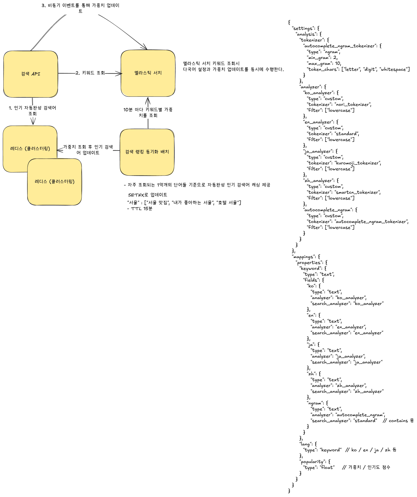

## 문제

### 1.배경
>당신은 글로벌 서비스용 검색어 자동완성 시스템 설계자입니다.
다양한 언어를 지원하며, 천만 명 이상의 사용자가 동시에 이용하는 대규모 서비스로, 빠르고 정확한 자동완성 기능 제공이 핵심입니다.

### 2. 요구 사항
- 트래픽 규모
  DAU(Daily Active Users)가 천만 명으로 대규모 트래픽을 감당할 수 있어야 합니다.

- 다국어 지원
  한국어, 영어, 일본어 등 여러 언어를 지원해야 합니다.

- 자동완성 검색어 일치 범위
  사용자가 입력하는 단어가 자동완성 될 검색어의 시작 부분이거나 중간 부분에 위치할 수 있습니다.

- 빠른 응답 속도
  사용자 입력에 따라 최대 100ms 이내에 자동완성 결과가 반환되어야 합니다.

- 추천 결과 수
  화면에 5개의 자동완성 검색어가 표시되어야 합니다.

- 인기 변동 반영 (선택 사항)
  특정 검색어의 인기가 갑자기 높아지는 경우, 해당 인기도 변화가 실시간 혹은 근접 실시간으로 자동완성에 반영되어야 합니다. (10분 이내 반영)

위 요구 사항을 기반으로, 효율적이며 확장 가능한 검색어 자동완성 시스템 아키텍처를 설계하십시오.

----

## 풀이

### 1. 검색어 조회
- 사용자가 요청한 검색어 키워드를 토크나이징하여 사용되는 국가 조회 
- 조회 후 redis에 저장된 해당 검색어의 인기 키워드 10개가 담긴 배열 조회

### 2. 검색어 업데이트
- 사용자가 입력한 키워드나 인기 검색어를 통해 검색 이벤트를 발생시키면 검색어와 매칭된 데이터 조회
- 데이터 반환 이전에 검색한 키워드를 엘라스틱 서치에서 가중치 업데이트 

### 3. 인기 검색어 업데이트
- 엘라스틱 서치에 저장된 인기 키워드 (특정 단어나 자음이 될 수 있음) 5천개 조회
- 해당 키워드에 매핑된 10개의 인기 검색어 조회 
- 조회 후 데이터를 redis에 업데이트함 . 배치가 수행되는 10분 간격보다 5분 더 길게 TTL 설정함